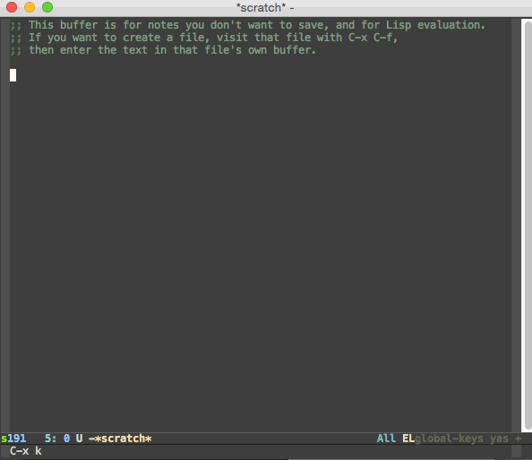

<h2>Table of Contents</h2>

<ul>
<li><a href="#orgheadline1">1. spotlight.el</a></li>
<li><a href="#orgheadline2">2. Overview</a></li>
<li><a href="#orgheadline3">3. Functions</a></li>
<li><a href="#orgheadline4">4. Example</a></li>
<li><a href="#orgheadline5">5. Installation</a></li>
<li><a href="#orgheadline6">6. Customisation</a></li>
<li><a href="#orgheadline7">7. Known issues</a></li>
<li><a href="#orgheadline8">8. Credits</a></li>
</ul>

# spotlight.el

Emacs package to search for files using Mac OS X spotlight.

# Overview

The functionality is similar to e.g. `rgrep` with the advantages that

-   The search is quicker as it queries the spotlight database.
-   The search can be performed dynamically, updating as the search
    string is changed
-   The list of file names can be dynamically narrowed by typing a
    filter
-   When a file is selected it is opened with a `swiper` search running
    with the original search query

# Functions

Provides two functions. These are:

1.  `spotlight`, which prompts for a query string and searches the
    spotlight database with dynamic updates for each new character
    entered. You'll be given a list of files that match. Selecting a
    file will launch `swiper` for that file searching for the query
    string.

    Alternatively, the user can use `M-RET` to dynamically filter the
    list of matching files to reduce the number of matches before
    selecting a file.

2.  `spotlight-fast` is the same as `spotlight` but the user is
    prompted for a query string to search the spotlight database
    without incremental updates. This can be faster than
    `spotlight`. The list of matching files containing the query string
    in their bodies are presented and the user can select the file or
    type a string to dynamically filter the list of files by filename.
    The selected file is then opened and a `swiper` search using the
    original query is launched.

# Example

In the animation below, I run a spotlight search for "tomatoes".
Notice how the number of matches updates as I type or delete the last
couple of characters. I then use `M-RET` to narrow the list of matching
files using the string "docs org$" which narrows the list to files
with "doc" in their full name, and with names ending in "org". Finally
once I select the file I want, `swiper` takes me to the matches of my
original "tomatoe" query.

# Installation

The best way to install this package is from MELPA using
`package-list-packages`.

# Customisation

Customise the variable `spotlight-min-chars` to set the minimum
number of characters that must be entered before the first
spotlight search is performed in `spotlight`. Setting
`spotlight-min-chars` to a lower number will result in more matches
and can lead to slower performance.

Customise the variable `spotlight-base-dir` to specify the default
base directory for the spotlight search for both `spotlight` and
`spotlight-live`. The spotlight database will be queried for files
below this directory. Default is user's home directory. Use '/' to
search everywhere. Alternatively, both `spotlight` and
`spotlight-fast` can be called with a prefix argument, in which
case they will prompt for a base directory.

# Known issues

-   `spotlight` is slow for queries resulting in large numbers of
    matches, taking 5-10 seconds for the initial update.
    This is [apparently a bug in Emacs on OS X](https://www.reddit.com/r/emacs/comments/3m97if/big_delays_when_running_a_shell_command/) and the work around is to
    write the spotlight results to a temporary file and then read that
    back into a buffer. The temp file can be configured with
    `spotlight-tmp-file`, which defaults to `~/.emacs-spotlight-tmp-file`.

-   When a query with multiple words is used, OS X spotlight will
    return a list of files containing those words anywhere in the body.
    When one is selected, the `swiper` search will search for the query
    string but will only find matches where all of the words in the
    query are on the same line in the file.

    In this case, use e.g. `M-DEL` to remove words from the `swiper`
    string until matches are found.

# Credits

Some of the code is based on parts of counsel.el by Oleh Krehel
at <https://github.com/abo-abo/swiper>

The dynamic filtering is done with the ivy library by the same
author

Thanks to commenters on <https://www.reddit.com/r/emacs> for feedback
on an early version of the package
